# 🎓 StudentDeck

### Your Campus, All in One Place

**Connect • Buy • Sell • Share**

StudentDeck is a student-focused campus community platform that brings essential college activities together in one place. Students can explore campus listings, share academic resources, discover events, report lost and found items, and communicate with fellow students.

<p align="center">
  <a href="https://studentdeck.netlify.app/">
    
  </a>
</p>

---

## 📸 Screenshots

Explore the main features and interface of StudentDeck.

### 🏠 Home

<p align="center">
  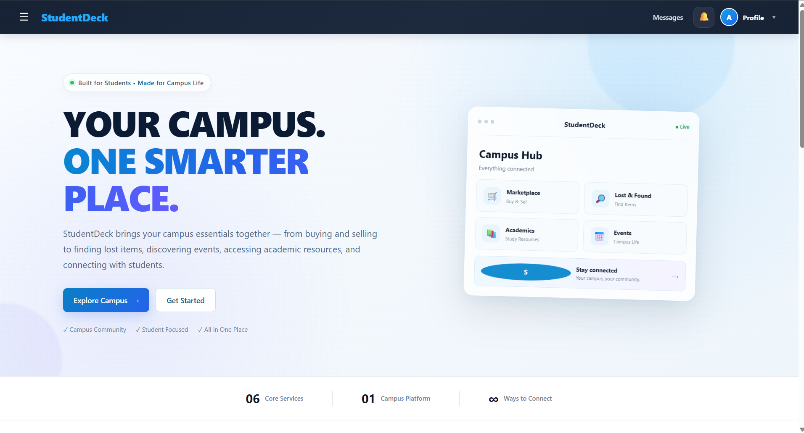
  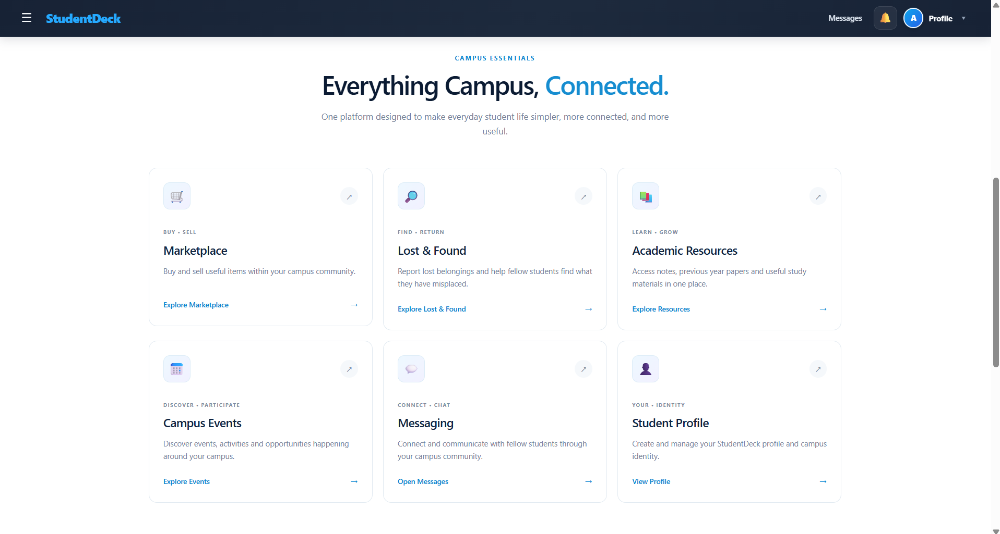
</p>

### 🛒 Campus Marketplace

Buy, sell, or give away useful college items.

<p align="center">
  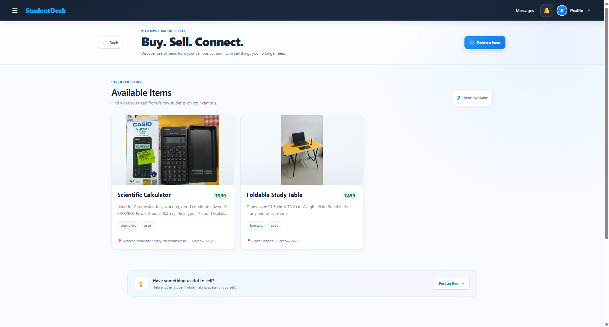
  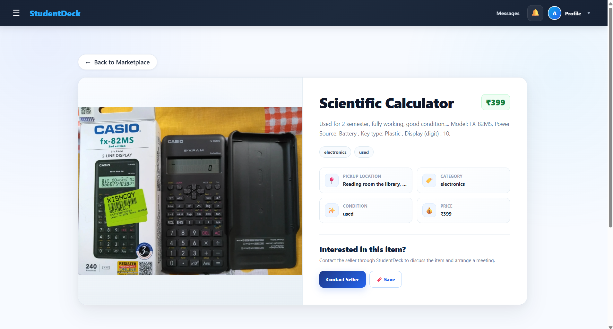
</p>

### 📚 Academic Resources

Discover and share study materials and academic resources.

<p align="center">
  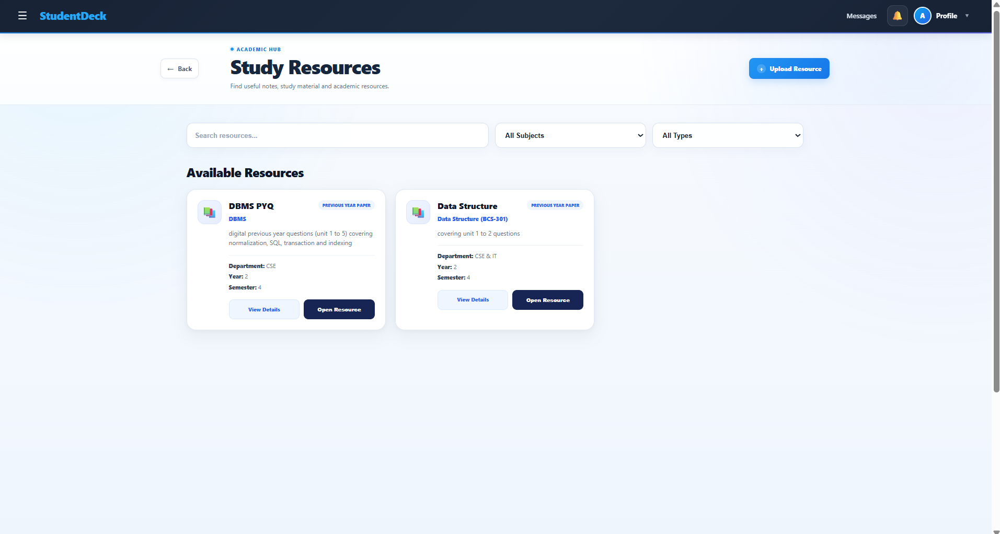
  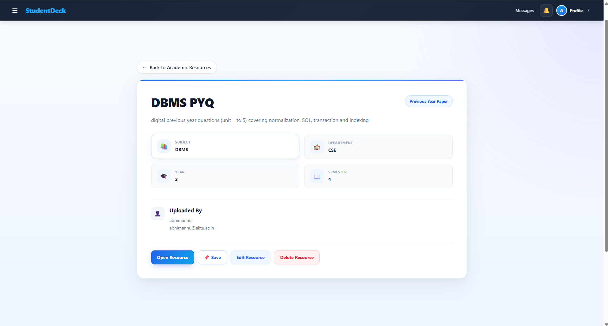
</p>

### 🎉 Campus Events

Explore campus activities, workshops, and events.

<p align="center">
  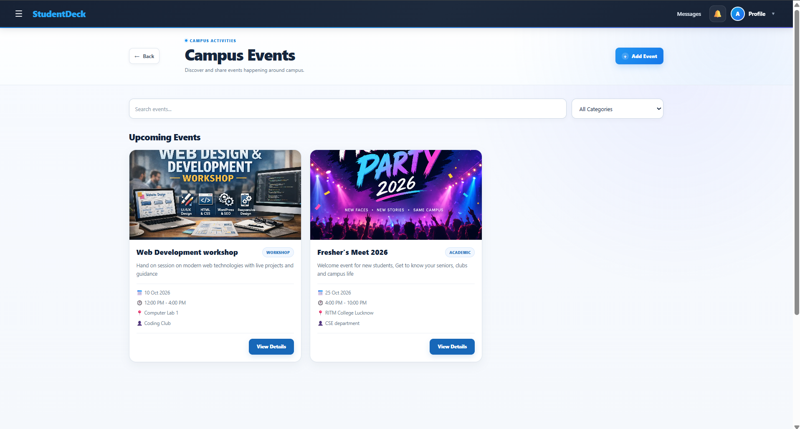
  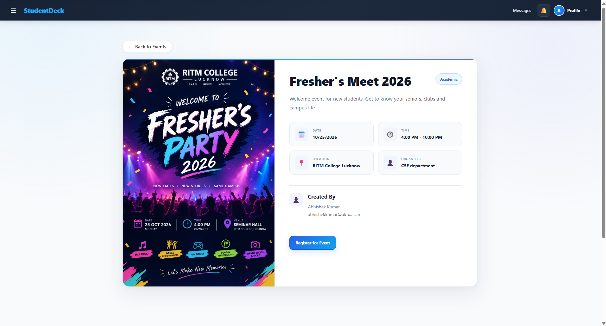
</p>

### 🔍 Lost & Found

Report missing belongings and help reunite found items with their owners.

<p align="center">
  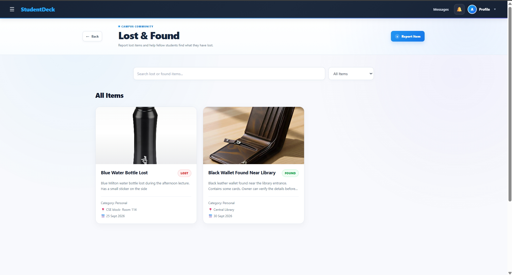
  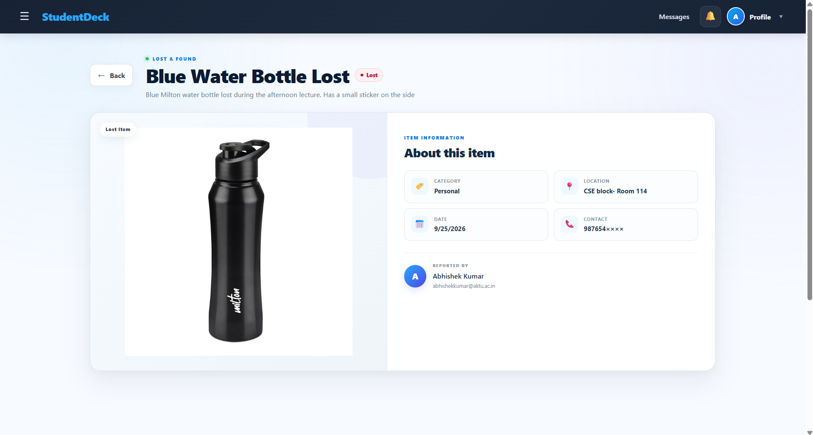
</p>

### 💬 Real-Time Messaging

Communicate directly with other students through the messaging interface.

<p align="center">
  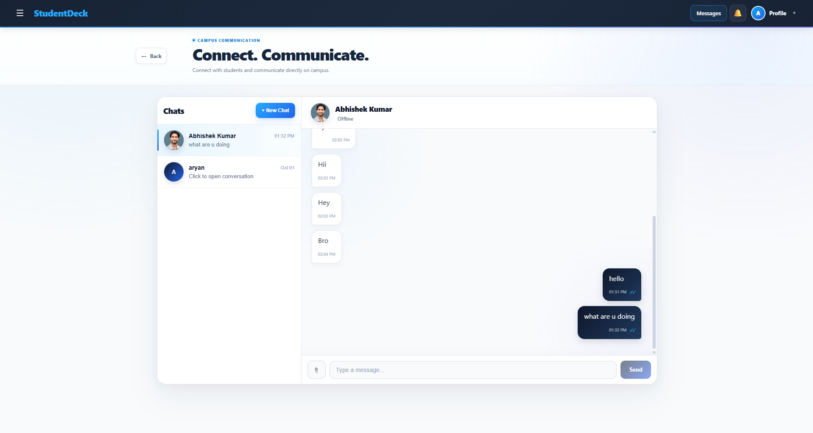
</p>

---

## ✨ Key Features

### 🛒 Campus Marketplace

* Create and browse item listings.
* Add descriptions, prices, categories, conditions, and locations.
* Upload product images.
* List items for sale or give them away for free.
* Connect with sellers through messaging.

### 📚 Academic Resources

* Share and discover study materials.
* Organize resources by academic categories.
* Find notes, practice questions, and previous-year papers when available.
* Support collaborative learning among students.

### 🎉 Campus Events

* Publish and explore campus events.
* Display event descriptions, dates, and venues.
* Discover workshops, seminars, technical festivals, and cultural activities.

### 🔍 Lost & Found

* Create lost-item and found-item reports.
* Include descriptions, categories, dates, locations, and images.
* View detailed item information.
* Allow owners to manage their own posts.

### 💬 Real-Time Messaging

* Send and receive messages.
* View conversation history.
* Share supported image and document attachments.
* Display online presence and typing indicators when configured.
* Support message delivery and read-status updates where implemented.

### 👤 Authentication & Profiles

* Register and log in.
* Access user profile information.
* Associate content with its creator.
* Protect authenticated operations.

### 📱 Responsive Interface

* Responsive desktop and mobile layouts.
* Reusable UI components.
* Feature-specific pages and forms.
* Mobile-friendly messaging and navigation.

---

## 🧩 Project Modules

| Module       | Description                                  |
| ------------ | -------------------------------------------- |
| Home         | Overview of the platform and its features    |
| Marketplace  | Buying, selling, and giving away items       |
| Academic     | Sharing educational resources                |
| Events       | Discovering and publishing campus activities |
| Lost & Found | Reporting and recovering belongings          |
| Messages     | Direct communication between students        |
| Profile      | User information and account activity        |

---

## 🛠️ Tech Stack

| Technology   | Purpose                                |
| ------------ | -------------------------------------- |
| React        | User interface                         |
| Vite         | Frontend development and build tooling |
| JavaScript   | Application logic                      |
| React Router | Client-side navigation                 |
| CSS3         | Styling and responsive layouts         |
| Node.js      | Backend runtime                        |
| Express.js   | Backend API                            |
| MongoDB      | Database                               |
| JWT          | Authentication                         |
| Socket.IO    | Real-time communication                |
| Cloudinary   | Media uploads                          |
| Netlify      | Frontend deployment                    |
| Render       | Backend hosting, if configured         |

---

## 🏗️ Architecture

StudentDeck follows a client-server architecture.

```text
                    StudentDeck
                         |
              +----------+----------+
              |                     |
         React Frontend        Backend API
             (Vite)           (Node.js/Express)
              |                     |
         React Router          +-----+------+
                               |            |
                            MongoDB     Cloudinary
                               |
                         REST API / JWT
                               |
                            Socket.IO
                        Real-Time Chat
```

The frontend communicates with the backend through API requests. The backend manages application logic, authentication, and data operations, while configured external services support media uploads and real-time communication.

---

## 📂 Repository Structure

The exact structure may vary depending on how the frontend and backend are organized.

```text
StudentDeck/
├── client/
│   ├── public/
│   ├── src/
│   │   ├── components/
│   │   ├── pages/
│   │   ├── services/
│   │   ├── assets/
│   │   ├── App.jsx
│   │   └── main.jsx
│   ├── package.json
│   └── vite.config.js
├── server/
│   ├── routes/
│   ├── controllers/
│   ├── models/
│   ├── middleware/
│   ├── package.json
│   └── server.js
├── screenshots/
├── .gitignore
└── README.md
```

---

## ⚙️ Getting Started

### Prerequisites

* [Node.js](https://nodejs.org/)
* npm
* [Git](https://git-scm.com/)
* MongoDB or MongoDB Atlas, if required by the backend
* Credentials for configured external services

### 1. Clone the Repository

```bash
git clone YOUR_GITHUB_REPOSITORY_URL
cd StudentDeck
```

Replace `YOUR_GITHUB_REPOSITORY_URL` with your actual repository URL.

### 2. Install Dependencies

For a project with separate frontend and backend directories:

```bash
cd client
npm install
```

Open another terminal and install backend dependencies:

```bash
cd server
npm install
```

Run these commands from the correct repository root or directory according to your actual folder structure.

### 3. Configure Environment Variables

Create the required `.env` files in the appropriate directories.

**Frontend `.env` example:**

```env
VITE_API_URL=http://localhost:5000/api
VITE_SOCKET_URL=http://localhost:5000
```

**Backend `.env` example:**

```env
PORT=5000
MONGO_URI=your_mongodb_connection_string
JWT_SECRET=your_long_random_secret
CLIENT_URL=http://localhost:5173

CLOUDINARY_CLOUD_NAME=your_cloud_name
CLOUDINARY_API_KEY=your_api_key
CLOUDINARY_API_SECRET=your_api_secret
```

These are example values. Verify the actual environment variable names in your code before using them.

### 4. Start the Backend

From the backend directory, run the development script defined in `package.json`, for example:

```bash
npm run dev
```

### 5. Start the Frontend

From the frontend directory:

```bash
npm run dev
```

Open the local URL shown in the terminal. Vite commonly uses:

```text
http://localhost:5173
```

The available scripts may differ depending on your project configuration.

---

## 🌐 Deployment

### Frontend

The frontend is deployed on Netlify.

Typical settings for a Vite application:

| Setting           | Value             |
| ----------------- | ----------------- |
| Build command     | `npm run build`   |
| Publish directory | `dist`            |
| API URL           | `VITE_API_URL`    |
| Socket URL        | `VITE_SOCKET_URL` |

Configure environment variables in the Netlify dashboard and redeploy after changing them.

### Backend

If the backend is hosted on Render or another provider:

1. Configure the build and start commands.
2. Set the production environment variables.
3. Verify database connectivity.
4. Configure CORS for the frontend origin.
5. Configure Socket.IO origins if required.
6. Set the production API and socket URLs in the frontend.
7. Test authentication, uploads, and messaging after deployment.

---

## 🔒 Security

* Keep credentials and secrets in environment variables.
* Never commit private `.env` files.
* Validate user input on the backend.
* Verify ownership before editing or deleting user content.
* Restrict uploaded file types and sizes.
* Configure CORS for trusted origins.
* Protect private API endpoints with authentication and authorization.
* Avoid exposing sensitive personal information in public listings.

---

## 🧪 Testing Checklist

* [ ] User registration and login
* [ ] Marketplace listing creation and browsing
* [ ] Image uploads and validation
* [ ] Academic resource creation and browsing
* [ ] Event creation and display
* [ ] Lost & Found reporting and management
* [ ] Conversation creation and message sending
* [ ] Attachment upload and viewing
* [ ] Mobile responsiveness
* [ ] Production API and Socket.IO connectivity

---

## 🔮 Future Improvements

* College email verification.
* Search, sorting, and category filters.
* Saved listings and favorite resources.
* Notifications for messages and events.
* Event registration and participation tracking.
* Content moderation and reporting tools.
* Administrative dashboard.
* Automated testing and performance optimization.
* Accessibility improvements.

---

## 🤝 Contributing

Contributions, suggestions, and bug reports are welcome.

1. Fork the repository.

2. Create a feature branch:

   ```bash
   git checkout -b feature/your-feature-name
   ```

3. Commit your changes:

   ```bash
   git add .
   git commit -m "Describe your changes"
   ```

4. Push your branch:

   ```bash
   git push origin feature/your-feature-name
   ```

5. Open a Pull Request with a clear description of your changes.

---

## 📄 License

No license has been specified yet. Add a `LICENSE` file and update this section once you choose a license for the project.

---

## 👨‍💻 Contact

**Project:** StudentDeck

For questions, feedback, bug reports, or collaboration, please open an issue in this repository.

---

<p align="center">
  <b>StudentDeck</b><br/>
  <i>Your Campus. Your People. Your Support.</i>
</p>
